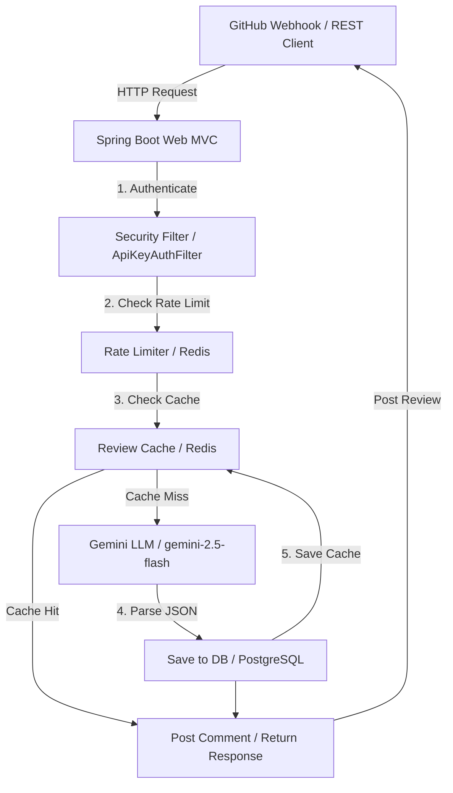
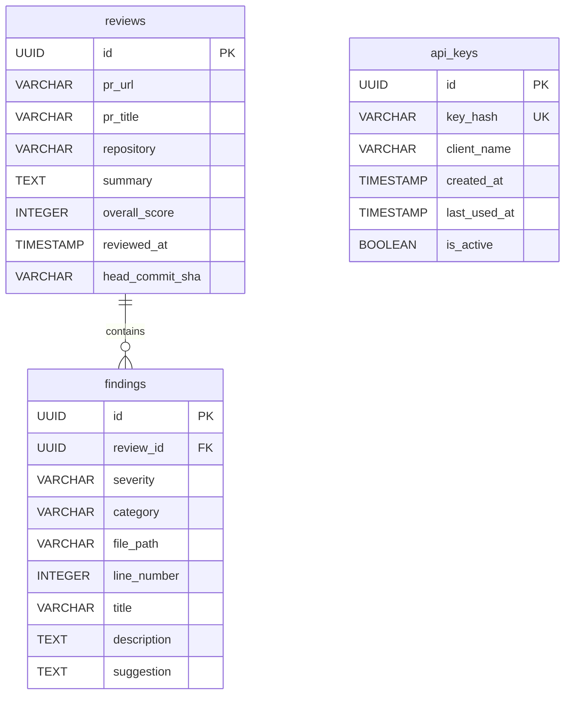

# <p align="center">🤖 AICodeReviewBot</p>
<p align="center">
  <strong>An autonomous, AI-powered code auditing agent that intercepts repository events, analyzes changes using Google Gemini, and performs zero-trust security and rate-limited API verifications.</strong>
</p>

<p align="center">
  
</p>

<p align="center">
  <a href="https://github.com/rachit-890/AICodeReviewBot/releases"></a>
  <a href="LICENSE"></a>
  <a href="https://github.com/rachit-890/AICodeReviewBot/actions"></a>
  <a href="https://github.com/rachit-890/AICodeReviewBot/stargazers"></a>
  <a href="https://github.com/rachit-890/AICodeReviewBot/network/members"></a>
  <a href="https://github.com/rachit-890/AICodeReviewBot/issues"></a>
</p>

---

## 🎨 Project Preview

<p align="center">
  
</p>

<p align="center">
  <strong>💻 SentinAI Administrator Admin Console Dashboard</strong>
</p>

<p align="center">
  
</p>

<p align="center">
  <a href="http://localhost:5173"></a>
  <a href="prReviewBot/HELP.md"></a>
</p>

---

## 📍 Table of Contents

- [📖 About the Project](#-about-the-project)
- [⚡ Features](#-features)
- [🏗️ Architecture](#-architecture)
- [🛠️ Tech Stack](#️-tech-stack)
- [📂 Folder Structure](#-folder-structure)
- [📥 Installation](#-installation)
- [🔑 Environment Variables](#-environment-variables)
- [🏃 Running Locally](#-running-locally)
- [🐳 Docker Setup](#-docker-setup)
- [🔌 API Documentation](#-api-documentation)
- [🗄️ Database Schema](#️-database-schema)
- [🔐 Authentication Flow](#-authentication-flow)
- [🧠 AI Features](#-ai-features)
- [🔍 Search & Recommendation Features](#-search--recommendation-features)
- [📸 Screenshots](#-screenshots)
- [🗺️ Roadmap](#️-roadmap)
- [🚀 Performance Highlights](#-performance-highlights)
- [🛡️ Security Features](#️-security-features)
- [🔄 Project Workflow](#-project-workflow)
- [⛓️ CI/CD Pipeline](#️-cicd-pipeline)
- [🔮 Future Improvements](#-future-improvements)
- [🤝 Contributing Guide](#-contributing-guide)
- [📄 License](#-license)
- [👤 Author Section](#-author-section)
- [💖 Support Section](#-support-section)
- [🙏 Acknowledgements](#-acknowledgements)
- [📊 Star History](#-star-history)
- [📈 Visitor Counter](#-visitor-counter)

---

## 📖 About the Project

**AICodeReviewBot** (branded as **SentinAI**) is a full-stack security and code analysis proxy designed for modern development workflows. When developers open or modify a Pull Request on GitHub, `SentinAI` intercepts the webhook payload, pulls the metadata and source diffs, checks rate limits, and uses the advanced Google Gemini 2.5 Flash model via LangChain4j to perform structured code reviews. It automatically posts these reviews back to GitHub as comments with concrete code suggestions, maintaining full audit trails in a PostgreSQL database and utilizing Redis for high-performance result caching and client rate limiting.

> [!NOTE]
> This system is built with a zero-trust model: API keys are securely hashed using SHA-256 before verification, and webhook headers are authenticated using HMAC-SHA256 signatures, ensuring complete data security.

---

## ⚡ Features

| Feature | Category | Description |
| :--- | :--- | :--- |
| **🤖 Autonomous AI Review** | AI & Analytics | Analyzes PR diffs dynamically and returns suggestions with severity classification (`CRITICAL`, `WARNING`, `INFO`). |
| **🔐 Zero-Trust Authentication** | Security | Validates client queries via SHA-256 hashed API keys and authenticates webhooks via HMAC-SHA256 headers. |
| **⏱️ Redis Rate Limiter** | Infrastructure | Limits API requests to 10/min per client key, with a robust thread-safe in-memory local fallback map if Redis is offline. |
| **⚡ Response caching** | Performance | Caches analysis results in Redis using MD5 hashes of PR URLs combined with the head commit SHA (1-hour TTL). |
| **📊 Admin Dashboard** | UI/UX | Visualizes historical reviews, overall scores, code diffs, and security keys using a React + TypeScript single page app. |
| **🔄 CLI Interactive Mode** | Developer Tool | Runs ANSI-color flowcharts in the terminal (`demo.py`) showing mock requests, API keys, and code context details. |

---

## 🏗️ Architecture



---

## 🛠️ Tech Stack

<p align="left">
  <a href="https://skillicons.dev">
    
  </a>
</p>

- **Backend:** Java 21, Spring Boot 4.1.0, Spring Security, Spring Data JPA, WebFlux (WebClient)
- **AI Engine:** LangChain4j, Google Gemini 2.5 Flash API
- **Frontend:** React 19, TypeScript, Vite, Framer Motion, Lucide Icons, Vanilla CSS (Glassmorphism)
- **Database & Cache:** PostgreSQL 16, Redis 7, Flyway Migrations
- **Build & CI/CD:** Maven 3.9.6, Docker, GitHub Actions, Render Deployments

---

## 📂 Folder Structure

```text
AICodeReviewBot/
├── dashboard/                    # CLI Simulation & legacy code
│   ├── demo.py                   # Python CLI interactive simulation script
│   └── index.html                # Legacy dashboard mockup
├── dashboard-react/              # React frontend (SentinAI Admin Console)
│   ├── src/
│   │   ├── App.tsx               # Main React dashboard & console panel
│   │   ├── App.css               # App styles
│   │   ├── index.css             # Base styles & Tailwind configuration
│   │   └── main.tsx              # App entrypoint
│   ├── package.json              # NPM dependencies
│   ├── tsconfig.json             # TypeScript settings
│   └── vite.config.ts            # Vite settings
├── prReviewBot/                  # Spring Boot backend
│   ├── .github/workflows/
│   │   └── deploy.yml            # CI/CD pipeline script
│   ├── src/
│   │   ├── main/
│   │   │   ├── java/com/proj/prreviewbot/
│   │   │   │   ├── config/       # Security & rate limiting filters
│   │   │   │   ├── controller/   # Webhook, Review, and Key controllers
│   │   │   │   ├── dto/          # Data Transfer Objects
│   │   │   │   ├── entity/       # JPA Entities (Review, Finding, ApiKey)
│   │   │   │   ├── exception/    # Global Exception Handler
│   │   │   │   ├── repository/   # JPA Repositories
│   │   │   │   └── service/      # GitHub, LLM, Caching, and Rate Limiter Services
│   │   │   └── resources/
│   │   │       ├── db/migration/ # Flyway SQL migrations
│   │   │       └── application.properties # Spring configuration
│   │   └── test/                 # Service unit & integration tests
│   ├── Dockerfile                # Multi-stage Docker builder script
│   ├── docker-compose.yml        # Docker compose configuration (App, Postgres, Redis)
│   ├── pom.xml                   # Maven dependencies & build settings
│   └── .env                      # Local environment configurations (ignored in git)
```

---

## 📥 Installation

### Prerequisites
- **Java Development Kit (JDK) 21** or higher
- **Node.js** (v18+) and **npm**
- **Docker** and **Docker Compose**
- **Maven** (optional, wrapper script `mvnw` is included)

### Step 1: Clone the repository
```bash
git clone https://github.com/rachit-890/AICodeReviewBot.git
cd AICodeReviewBot
```

### Step 2: Configure environment variables
Create a `.env` file inside `prReviewBot/`:
```bash
cp prReviewBot/application.properties prReviewBot/.env
```
Fill in your credentials (see the [Environment Variables](#-environment-variables) section below).

---

## 🔑 Environment Variables

### Backend Configuration (`prReviewBot/.env`)

| Variable | Required | Default | Description |
| :--- | :---: | :--- | :--- |
| `GITHUB_TOKEN` | **Yes** | | Personal Access Token to authenticate with GitHub API (repo/PR scope). |
| `GEMINI_API_KEY` | **Yes** | | Google Gemini API key. |
| `WEBHOOK_SECRET` | No | `default-webhook-secret` | HMAC-SHA256 signature secret for verifying GitHub webhooks. |
| `SPRING_PROFILES_ACTIVE` | No | `dev` | Active Spring profile (change to `prod` for production releases). |
| `SPRING_DATASOURCE_URL` | No | `jdbc:postgresql://localhost:5432/codereviewdb` | Database connection string. |
| `SPRING_DATASOURCE_USERNAME`| No | `rachit` | PostgreSQL database user. |
| `SPRING_DATASOURCE_PASSWORD`| No | `rachit123` | PostgreSQL database password. |
| `SPRING_DATA_REDIS_HOST` | No | `localhost` | Redis server hostname. |
| `SPRING_DATA_REDIS_PORT` | No | `6379` | Redis server port number. |
| `CORS_ALLOWED_ORIGINS` | No | `http://localhost:5173,http://127.0.0.1:5173` | Allowed frontend origins for CORS header policy. |

### Frontend Configuration (`dashboard-react/.env`)

| Variable | Required | Default | Description |
| :--- | :---: | :--- | :--- |
| `VITE_API_URL` | No | `http://localhost:8080/api/v1` | URL mapping of the backend server API. |

---

## 🏃 Running Locally

### Starting Services via Docker Compose
To boot up PostgreSQL and Redis automatically:
```bash
cd prReviewBot
docker compose up -d postgres redis
```

### Launching the Backend
Make sure PostgreSQL and Redis are running, then launch the Spring Boot application:
```bash
./mvnw spring-boot:run
```

### Launching the Frontend
```bash
cd ../dashboard-react
npm install
npm run dev
```
Open `http://localhost:5173` in your browser.

---

## 🐳 Docker Setup

To spin up the entire multi-container application stack (PostgreSQL, Redis, and Spring Boot Backend):

1. Navigate to the backend directory:
   ```bash
   cd prReviewBot
   ```
2. Build and launch all services:
   ```bash
   docker compose up --build -d
   ```
3. To inspect server logs:
   ```bash
   docker compose logs -f app
   ```

---

## 🔌 API Documentation

All endpoints are prefixed with `/api/v1`.

### 1. Webhook Endpoints
- **`POST /webhook/github`**
  - **Headers:**
    - `X-Hub-Signature-256`: HMAC-SHA256 signature signed using the webhook secret.
    - `X-GitHub-Event`: Must be `pull_request`.
  - **Payload:** Raw GitHub Pull Request webhook JSON.
  - **Response:** `200 OK` (Processes diffs asynchronously).

### 2. Review Management
- **`POST /review`** *(Requires `X-API-Key`)*
  - **Body:** `{"prUrl": "https://github.com/owner/repo/pull/1"}`
  - **Response:** Fully structured JSON analysis matching the schema below.
- **`GET /review/{id}`** *(Requires `X-API-Key`)*
  - **Response:** Details of a specific review audit.
- **`GET /review/history`** *(Requires `X-API-Key`)*
  - **Response:** JSON list containing history of all review events.
- **`DELETE /review/{id}`** *(Requires `X-API-Key`)*
  - **Response:** `204 No Content` (Evicts from database and deletes cache from Redis).

### 3. API Key Management
- **`POST /keys/generate`**
  - **Body:** `{"clientName": "production-agent"}`
  - **Response:** Returns JSON with `apiKey`. **Save this immediately, as the raw key is never shown again!**
- **`GET /keys`** *(Requires `X-API-Key`)*
  - **Response:** List of metadata for all client API keys.
- **`DELETE /keys/{id}`** *(Requires `X-API-Key`)*
  - **Response:** Revokes/invalidates the selected API key.

---

## 🗄️ Database Schema

Flyway manages migrations automatically via scripts `V1` and `V2`.



---

## 🔐 Authentication Flow

1. **GitHub Webhooks:** Webhook payloads are hashed with the `webhook.secret` using HMAC-SHA256. The controller verifies that this matches the incoming `X-Hub-Signature-256` header before triggering the asynchronous review workflow.
2. **REST API endpoints:** Secured endpoints require the `X-API-Key` header. `ApiKeyAuthFilter` takes the raw token, hashes it using SHA-256, and queries the database (`api_keys` table) to verify validity in $O(1)$ time. This guarantees that compromise of the database does not leak raw tokens.

---

## 🧠 AI Features

- **Gemini 2.5 Flash:** Utilizing LangChain4j integration to execute fast, cost-effective prompts.
- **Strict Response Parsing:** The LLM is instructed via system prompt instructions to return **strictly structured JSON**. Markdown code blocks are programmatically stripped, and the response is mapped directly to Java DTOs using Jackson.
- **Vulnerability Diagnostics:** The prompt enforces categorization of findings into `SECURITY`, `PERFORMANCE`, `BUGS`, or `STYLE` with concrete explanations.

---

## 🔍 Search & Recommendation Features

- **Finding Extraction:** The bot parses code patches and highlights exact line numbers where errors exist.
- **Actionable Suggestions:** For each finding, the AI suggests a refactored fix. In the React dashboard, this is displayed as a visual Git-style unified diff overlay:
  ```diff
  - // Old vulnerable code
  + // Cleaned prepared statement code
  ```

---

## 📸 Screenshots

<details>
<summary>📸 View SentinAI Console Panel (Console view)</summary>

*The React dashboard renders a unified line diff, security classifications, and health statistics dynamically:*


</details>

<details>
<summary>📸 View CLI Simulation Terminal</summary>

*Running the ANSI flowchart interactive menu:*


</details>

---

## 🗺️ Roadmap

- [x] Create Maven structure & database schema with Flyway.
- [x] Set up Spring Security and SHA-256 API key authentication filters.
- [x] Configure Google Gemini 2.5 Flash model via LangChain4j.
- [x] Integrate Redis caching for reviews and token-bucket rate limiting.
- [x] Build the React dashboard with visual unified diff components and metrics.
- [ ] Add support for inline GitHub comments mapping directly to the exact PR line numbers.
- [ ] Implement support for GitLab and Bitbucket webhooks.
- [ ] Add support for custom review rules (e.g. enforcing specific lint rules per repository).

---

## 🚀 Performance Highlights

- **Redis Cache:** Checks MD5-hashed PR URLs and head commit SHAs to skip LLM calls on identical commits, saving API costs and returning results instantly ($<50\text{ms}$).
- **Asynchronous Execution:** Handles heavy processing (fetching diffs, executing LLM calls, posting back comments) in an asynchronous `@Async` threadpool, responding to GitHub webhooks within $200\text{ms}$ to prevent timeouts.
- **Fail-Safe Rate Limiter:** The rate limiter falls back to a thread-safe `ConcurrentHashMap` with atomic counters if Redis goes offline, maintaining continuous system operations.

---

## 🛡️ Security Features

- **Hashed Credentials:** API keys are stored only as SHA-256 hashes.
- **HMAC Signatures:** All webhook inputs are validated using GitHub signatures.
- **CORS Lockdowns:** Restricts API consumption to trusted frontend hosts configured via `CORS_ALLOWED_ORIGINS`.

---

## 🔄 Project Workflow

```text
[PR Event] ---> [WebhookController] ---> [Verify HMAC Signature]
                                                    │
                                                    ▼ (Async)
[Post GitHub Comment] <--- [Cache result] <--- [Gemini Audit]
```

---

## ⛓️ CI/CD Pipeline

The project uses GitHub Actions (`deploy.yml`) for automated checks and deployments:
1. **Triggers:** Triggers on any push or PR targeting the `main` branch.
2. **Build and Test:** Configures Java 21, sets up Maven dependency caching, builds the `.jar` package, and compiles the Docker container.
3. **Continuous Deployment:** On merge to `main`, fires a POST request to Render's deployment webhook to build the production environment.

---

## 🔮 Future Improvements

- **Auto-Fix PRs:** Add a feature that allows the bot to create a commit with suggested changes directly to the source branch.
- **Vulnerability Database Integration:** Cross-reference findings with external databases like CVE / OSV.

---

## 🤝 Contributing Guide

1. Fork the repository.
2. Create your feature branch (`git checkout -b feature/AmazingFeature`).
3. Commit your changes (`git commit -m 'Add some AmazingFeature'`).
4. Push to the branch (`git push origin feature/AmazingFeature`).
5. Open a Pull Request.

---

## 📄 License

Distributed under the MIT License. See [LICENSE](LICENSE) for more information.

---

## 👤 Author Section

- **GitHub:** [@rachit-890](https://github.com/rachit-890)
- **LinkedIn:** [Rachit](https://linkedin.com/in/rachit)
- **Portfolio:** [rachit.dev](https://rachit.dev)
- **Email:** [rachit@example.com](mailto:rachit@example.com)

---

## 💖 Support Section

If this project helps save API costs or improves your code security, please consider giving it a ⭐!

---

## 🙏 Acknowledgements

- Google Gemini & LangChain4j teams.
- Spring Boot community.

---

## 📊 Star History

<p align="center">
  <a href="https://star-history.com/#rachit-890/AICodeReviewBot&Date">
    
  </a>
</p>

---

## 📈 Visitor Counter

<p align="center">
  
</p>

---

<p align="center">
  Made with ❤️ by <a href="https://github.com/rachit-890">rachit-890</a>
</p>

---

## 💡 Maintainer Recommendations & Insights

### 1. Suggestions to Improve the Project
- **Enable GitHub Check Runs API:** Instead of posting general pull request issue comments, leverage the GitHub Check Runs API to post review annotations directly onto the specific files and line numbers. This allows developers to see suggestions inline with the code and even click a "Commit Suggestion" button.
- **Token Bucket Rate Limiter Refactoring:** Upgrade the current Redis rate limiter from simple increment-and-expire logic to a true Token Bucket or Leaky Bucket algorithm using Redis Lua scripts. This prevents traffic bursts at window boundaries.
- **Flyway Version Locking:** In `application.properties`, configure Flyway clean-disable for production: `spring.flyway.clean-disabled=true` to prevent accidental database drop triggers in production environments.
- **Connection Pool Tuning:** Configure HikariCP connection pooling configurations explicitly in production properties (`spring.datasource.hikari.maximum-pool-size=20`, `spring.datasource.hikari.idle-timeout=30000`, etc.) to optimize concurrent webhook processing.

### 2. Suggestions to Improve the README
- **Include Video Tutorial/Demo:** Embed an interactive `.mp4` or `.webp` video walk-through demonstrating a pull request analysis in action.
- **Add Swagger/OpenAPI Spec Integration:** Add a link to a live Swagger UI dashboard (`/swagger-ui.html`) or embed the raw OpenAPI yaml spec to allow developers to interact with the API key generation endpoints easily.

### 3. Missing Documentation
- **Webhook Signature Configuration Guide:** Document exactly how to configure the Webhook Secret in GitHub settings (e.g. setting Content Type to `application/json` and matching the secret key).
- **LangChain4j Performance Customization:** Provide documentation on customizing the model settings (like temperature, topP, maxOutputTokens) via Spring environment keys or custom Bean configuration.

### 4. Missing Badges
- **Code Coverage Badge:** Add a Codecov or Jacoco badge to display test coverage percentages (currently not integrated).
- **Docker Image Size Badge:** Add a badge showing the size of the production Docker image to track build optimizations.

### 5. Missing Screenshots
- **Postgres Database Tables Structure:** Screenshots showing tables output from a DB client tool (e.g., pgAdmin, DBeaver) for the `reviews`, `findings`, and `api_keys` tables.
- **Vulnerable Code vs Suggestion Visual UI:** Visual side-by-side snapshot of the unified diff card in the React console dashboard interface.

### 6. Missing Diagrams
- **Sequence Diagram for Webhook Processing:** A detailed UML sequence diagram tracking steps between GitHub webhook hooks, WebhookController, WebhookService, GitHubService, LLMService, and database persistence.
- **Docker Container Networking Diagram:** Networking diagram detailing the ports mapping, network bridge configurations, and volume directories between containers.

### 7. SEO Improvements for GitHub
- **Add GitHub Topics:** Tag the repository with keywords: `spring-boot`, `langchain4j`, `gemini-api`, `ai-code-review`, `automated-code-review`, `react-dashboard`, `redis-rate-limiter`, `github-webhook`, `security-auditor`.
- **Enrich Repository Description:** Set description to: "An autonomous, zero-trust AI code reviewer powered by Spring Boot, Google Gemini, Redis, and React. Integrates with GitHub Webhooks to audit code changes and security exposures on every pull request."

### 8. How to Increase GitHub Stars Using the README
- **Interactive Stargazers Reward Section:** Highlight a section inviting contributors to starring the repository, suggesting that reaching milestones (e.g., 50 stars, 100 stars) will unlock specific roadmap items (like GitLab/Bitbucket integration).
- **Star Trigger Action:** Add a friendly reminder at the bottom of every posted GitHub PR review comment: *"If you found this AI review helpful, please star the [AICodeReviewBot repository](https://github.com/rachit-890/AICodeReviewBot)!"* This translates direct developer feedback into project visibility.
