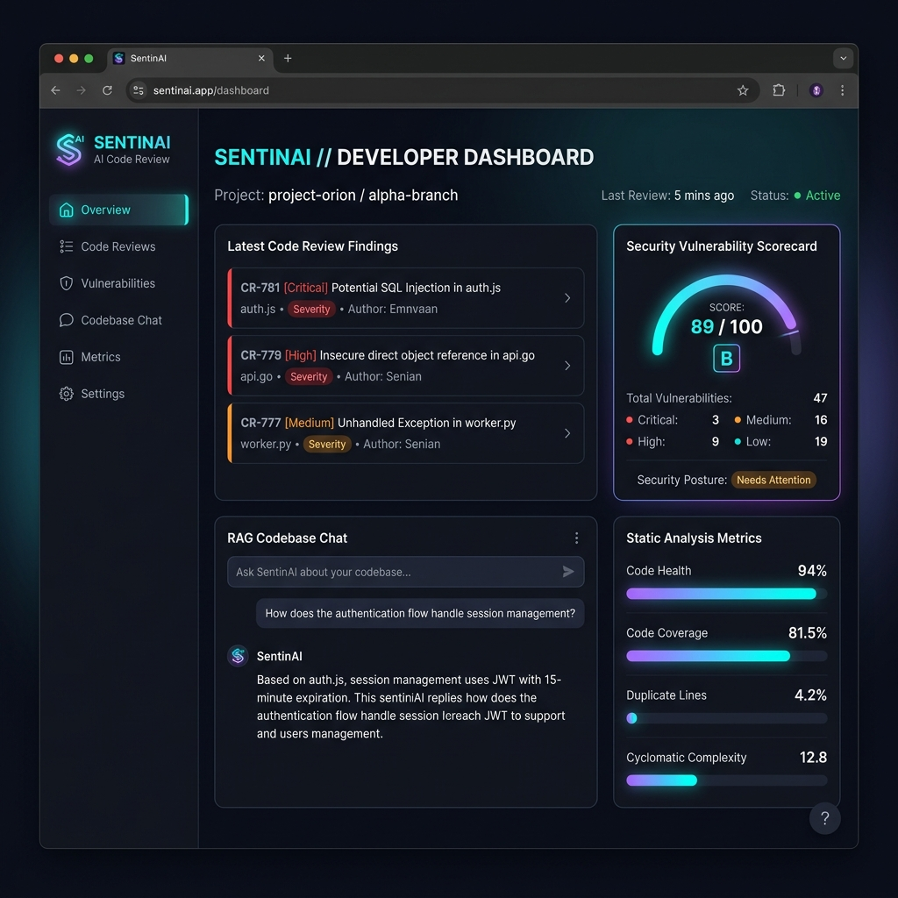

# SentinAI — AI-Powered Automated Code Review & RAG Platform

SentinAI (AICodeReviewBot) is an enterprise-grade automated code review platform designed to streamline pull request evaluations, conduct multi-agent security and performance audits, perform retrieval-augmented generation (RAG) over entire codebases, and auto-generate developer documentation.



---

## Architecture Overview

SentinAI operates as a distributed microservice architecture consisting of a **Spring Boot 4 Core Backend**, a **FastAPI + LangGraph Multi-Agent Service**, a **React + Vite Developer Dashboard**, and persistent storage backed by **PostgreSQL (with PgVector)** and **Redis**.

```mermaid
flowchart TD
    subgraph Clients & Webhooks
        GH[GitHub Webhook / PR Event]
        FE[React Dashboard (Vite @ :5173)]
        CLI[External API Client / Curl]
    end

    subgraph Core System Boundaries
        subgraph Java Backend ["Spring Boot Backend (:8080)"]
            SEC[Security & ApiKeyAuthFilter]
            R_CTRL[ReviewController]
            W_CTRL[WebhookController]
            C_CTRL[ChatController / RAG]
            D_CTRL[DocStudioController]
            S_CTRL[SonarController]
            K_CTRL[ApiKeyController]
            
            FLY[Flyway Database Migrations]
            JPA[Spring Data JPA / Hibernate]
            LC4J[LangChain4j Engine]
        end

        subgraph Python Agent ["Agent Microservice (:8000)"]
            FASTAPI[FastAPI Router]
            LG_SEC[LangGraph Security Agent]
            LG_PERF[LangGraph Performance Agent]
            LG_AGG[LangGraph Aggregator Node]
        end
    end

    subgraph Data & Storage Layer
        PG[(PostgreSQL 16+)]
        PGV[(PgVector Store - 768d)]
        REDIS[(Redis Cache & Rate Limiter)]
        GEMINI[Google Gemini 1.5 Flash API]
        SONAR[SonarQube Server]
    end

    GH -->|POST /api/v1/webhook/github| W_CTRL
    FE -->|API Requests + X-API-Key| SEC
    CLI -->|API Requests + X-API-Key| SEC
    
    SEC --> R_CTRL
    SEC --> C_CTRL
    SEC --> D_CTRL
    SEC --> S_CTRL
    SEC --> K_CTRL

    R_CTRL -->|Cache Check & Eviction| REDIS
    R_CTRL -->|Save / Fetch Reviews| JPA
    R_CTRL -->|LLM Review Generation| GEMINI
    R_CTRL -->|HTTP Delegate| FASTAPI

    C_CTRL -->|Code Embeddings Search| LC4J
    LC4J -->|Vector Similarity Queries| PGV

    FASTAPI --> LG_SEC --> LG_PERF --> LG_AGG --> GEMINI

    JPA --> PG
    FLY --> PG
    S_CTRL -->|REST Issue Query| SONAR
```

---

## Core Components

| Component | Stack | Directory | Description |
| :--- | :--- | :--- | :--- |
| **Java Core Backend** | Spring Boot 4.1.0, Java 21, HikariCP, Flyway | `prReviewBot/` | Primary API orchestrator handling GitHub PR fetching, review persistence, RAG indexing, API key authentication, rate limiting, and webhook validation. |
| **Agent Microservice** | Python 3.11+, FastAPI 0.110+, LangGraph | `agent-service/` | Specialized multi-agent audit pipeline executing automated security checks, memory/performance bottleneck analysis, and executive synthesis using Gemini models. |
| **Developer Dashboard** | React 18, TypeScript, Vite 5, Tailwind CSS | `dashboard-react/` | Modern single-page web interface for visualizing PR review scorecards, interactive RAG repository chat, API key management, and SonarQube static metrics. |
| **Legacy Prototype** | Plain HTML5, Vanilla JavaScript, Python Demo Server | `dashboard/` | *(Unintegrated)* Initial static prototype used during early UI ideation. Superseded by `dashboard-react/`. |

---

## Tech Stack & Versions

- **JDK / Runtime**: OpenJDK 21 (Eclipse Temurin)
- **Framework**: Spring Boot `4.1.0` (`spring-boot-starter-parent`)
- **Python Runtime**: Python `3.11+`
- **FastAPI / LangGraph**: `fastapi>=0.110.0`, `langgraph>=0.0.26`, `langchain-google-genai`
- **Frontend Stack**: React `18.3.1`, TypeScript `5.5`, Vite `5.4.1`, Tailwind CSS `3.4.1`
- **Database & Migrations**: PostgreSQL 16+ with `pgvector` extension, Flyway 10+ (`spring-boot-starter-flyway`)
- **Cache & Rate Limiting**: Redis 7+ (`spring-boot-starter-data-redis` / Lettucectx)
- **AI Integrations**: LangChain4j (`1.15.1`), Google Gemini 1.5 Flash API
- **Static Analysis**: SonarQube Web API Integration

---

## Repository Structure

```
AICodeReviewBot/
├── agent-service/               # Python FastAPI + LangGraph Multi-Agent Microservice
│   ├── main.py                  # Entry point (Security, Performance & Aggregator graph nodes)
│   ├── requirements.txt         # Python dependencies
│   └── Dockerfile               # Container build configuration for Python service
├── dashboard-react/             # Production React + TypeScript + Vite Web Dashboard
│   ├── src/                     # React components, API services, and pages
│   ├── package.json             # Node dependencies and build scripts
│   └── vite.config.ts           # Vite build configuration
├── dashboard/                   # [LEGACY] Unintegrated static HTML demo prototype (Superseded)
│   ├── index.html               # Legacy static preview layout
│   └── demo.py                  # Legacy standalone Python preview server
├── docs/                        # Project documentation assets and images
│   └── images/                  # Screenshots and architectural diagrams
├── prReviewBot/                 # Main Java Spring Boot Core Service
│   ├── src/main/java/           # Spring Boot source code (Controllers, Services, DTOs, Entities)
│   ├── src/main/resources/      # Application properties and Flyway SQL migrations (db/migration/)
│   ├── pom.xml                  # Maven project POM (Spring Boot 4.1.0, Java 21)
│   ├── Dockerfile               # Multi-stage Maven + Eclipse Temurin 21 Dockerfile
│   └── .github/workflows/       # [MISPLACED] Legacy CI deployment workflow (See Known Limitations)
├── render.yaml                  # Infrastructure-as-code template for Render deployment
└── README.md                    # System documentation
```

---

## Environment Variables & Configuration

The Java backend (`prReviewBot`) and Python microservice (`agent-service`) accept the following environment variables:

| Variable Name | Required | Default Value | Description |
| :--- | :---: | :--- | :--- |
| `SPRING_PROFILES_ACTIVE` | No | `dev` | Active Spring profile (`dev` or `prod`). `prod` sets `ddl-auto=validate`. |
| `PORT` | No | `8080` (Java) / `8000` (Python) | Application server HTTP port. |
| `GITHUB_TOKEN` | **Yes** | *None* | GitHub Personal Access Token for fetching PR diffs and posting review comments. |
| `GEMINI_API_KEY` | **Yes** | *None* | Google Gemini API Key used by LangChain4j and LangGraph agents. |
| `WEBHOOK_SECRET` | No | `default-webhook-secret` | HMAC-SHA256 secret key for validating GitHub webhook payloads. |
| `SPRING_DATASOURCE_URL` | **Yes** | `jdbc:postgresql://localhost:5432/codereviewdb` | PostgreSQL JDBC connection URL. |
| `SPRING_DATASOURCE_USERNAME`| **Yes** | `rachit` | PostgreSQL database user. |
| `SPRING_DATASOURCE_PASSWORD`| **Yes** | `rachit123` | PostgreSQL database password. |
| `SPRING_DATA_REDIS_HOST` | No | `localhost` | Redis server hostname. |
| `SPRING_DATA_REDIS_PORT` | No | `6379` | Redis server port. |
| `SPRING_DATA_REDIS_PASSWORD`| No | *Empty* | Redis server password (if required). |
| `CORS_ALLOWED_ORIGINS` | No | `http://localhost:5173,http://127.0.0.1:5173` | Comma-separated CORS allowed origins. |
| `SONARQUBE_URL` | No | `http://localhost:9000` | SonarQube server base URL. |
| `SONARQUBE_TOKEN` | No | *Empty* | SonarQube authentication token. |

---

## API Reference

### 1. Spring Boot Core Service (`prReviewBot`)

#### **API Key Management (`/api/v1/keys`)**
- `POST /api/v1/keys/generate`: Generate a new client API key (`X-API-Key`).
- `GET /api/v1/keys`: List metadata for all generated API keys.
- `DELETE /api/v1/keys/{id}`: Revoke an API key by its UUID.

#### **Code Review & History (`/api/v1`)**
- `POST /api/v1/review`: Trigger automated AI review for a GitHub PR URL. Fetches PR diff, checks Redis cache, invokes LLM, persists findings to Postgres, and posts back to GitHub.
- `GET /api/v1/review/{id}`: Retrieve detailed review findings by review UUID.
- `GET /api/v1/review/history`: List history of all past pull request reviews.
- `DELETE /api/v1/review/{id}`: Delete review record from Postgres and evict cached entry from Redis.
- `GET /api/v1/health-check`: Simple health status endpoint (unauthenticated).

#### **RAG Repository Chat & Indexing (`/api/v1`)**
- `POST /api/v1/chat`: Query indexed repository codebase using PgVector vector embeddings.
- `POST /api/v1/rag/index`: Index source code files from local/cloned repository paths into PgVector (supports `sync=true` or asynchronous background execution).

#### **Doc Studio (`/api/v1/doc`)**
- `POST /api/v1/doc/explain`: Explain complex code snippets in natural language.
- `POST /api/v1/doc/generate`: Auto-generate structured documentation (e.g. README, API Specs) for codebases.

#### **SonarQube Integration (`/api/v1/sonar`)**
- `GET /api/v1/sonar/issues`: Fetch static analysis code smells, vulnerabilities, and metrics from SonarQube.

#### **GitHub Webhook (`/api/v1/webhook`)**
- `POST /api/v1/webhook/github`: Asynchronous webhook handler for GitHub `pull_request` events with HMAC-SHA256 signature verification (`X-Hub-Signature-256`).

---

### 2. Python LangGraph Agent Microservice (`agent-service`)

- `GET /health`: Health status of the Python LangGraph microservice.
- `POST /api/v1/agent/review`: Runs multi-agent LangGraph workflow (`SecurityAgent` -> `PerformanceAgent` -> `Aggregator`) over code diffs.

---

## Authentication & Security Model

SentinAI enforces API key authentication and sliding-window rate limiting via a custom Spring Security filter:

1. **Custom Filter Pipeline**: `ApiKeyAuthFilter` intercepts incoming requests prior to Spring Security's `UsernamePasswordAuthenticationFilter`.
2. **Key Validation**: Checks the `X-API-Key` HTTP header, hashes the incoming token using SHA-256, and verifies it against the `api_keys` table in PostgreSQL.
3. **Rate Limiting**: Uses `RateLimiterService` to track client request volume against Redis (falling back to in-memory sliding windows if Redis is unavailable). Enforces a limit of **10 requests per minute per client key**, returning HTTP `429 Too Many Requests` when exceeded.
4. **Public Exemptions**: The following paths bypass API key authentication:
   - `/api/v1/health-check`
   - `/api/v1/keys/generate`
   - `/api/v1/webhook/github`
   - `/actuator/**`, `/v3/api-docs/**`, `/swagger-ui/**`

---

## Running Locally

### Prerequisites
- Java 21 JDK installed (`java -version`)
- Maven 3.9+ (`mvn -version`)
- Python 3.11+ and `pip`
- Node.js 18+ and `npm`
- Running PostgreSQL 16 instance with `pgvector` extension
- Running Redis instance

### Step 1: Start PostgreSQL & Redis
```bash
docker run -d --name sentinai-postgres -p 5432:5432 \
  -e POSTGRES_DB=codereviewdb \
  -e POSTGRES_USER=rachit \
  -e POSTGRES_PASSWORD=rachit123 \
  ankane/pgvector:v0.5.1

docker run -d --name sentinai-redis -p 6379:6379 redis:7-alpine
```

### Step 2: Run Spring Boot Backend
```bash
cd prReviewBot
export GITHUB_TOKEN="your_github_token"
export GEMINI_API_KEY="your_gemini_api_key"
mvn spring-boot:run
```

### Step 3: Run Python Agent Microservice
```bash
cd agent-service
python3 -m venv venv
source venv/bin/activate
pip install -r requirements.txt
export GEMINI_API_KEY="your_gemini_api_key"
uvicorn main:app --host 0.0.0.0 --port 8000 --reload
```

### Step 4: Run React Developer Dashboard
```bash
cd dashboard-react
npm install
npm run dev
```
Open [http://localhost:5173](http://localhost:5173) in your browser.

---

## Docker Deployment

Both backend components contain production Dockerfiles.

### Build & Run Java Backend Container:
```bash
cd prReviewBot
docker build -t sentinai-backend .
docker run -p 8080:8080 \
  -e GITHUB_TOKEN="your_token" \
  -e GEMINI_API_KEY="your_key" \
  -e SPRING_DATASOURCE_URL="jdbc:postgresql://host.docker.internal:5432/codereviewdb" \
  sentinai-backend
```

### Build & Run Python Agent Container:
```bash
cd agent-service
docker build -t sentinai-agent .
docker run -p 8000:8000 -e GEMINI_API_KEY="your_key" sentinai-agent
```

---

## Known Limitations & Configuration Drift

1. **`render.yaml` Infrastructure Drift**: The blueprint file `render.yaml` specifies hardcoded database names (`codereviewdb`) and users (`rachit`). In actual Render cloud deployments, managed PostgreSQL instances generate random database names and user credentials (e.g. `code_review_db_59f8`). `render.yaml` serves as an initial template and must be updated to align with active credentials.
2. **Misplaced GitHub Actions Workflow**: The workflow configuration `deploy.yml` currently resides at `prReviewBot/.github/workflows/deploy.yml`. GitHub Actions requires workflow files to be located at the root level (`.github/workflows/deploy.yml`). As a result, automated CI/CD triggers on push/PR are currently inactive.
3. **Legacy Prototype Directory**: The root `/dashboard` directory contains an unintegrated static HTML/Python prototype. It is obsolete and superseded by `dashboard-react/`.
4. **Render Free-Tier Storage**: PostgreSQL databases created under Render's free tier automatically expire after 90 days of continuous operation. Production deployments require upgrading to a persistent database tier or re-provisioning.

---

## Project Summary

> **SentinAI Architecture Summary**
> SentinAI is a cloud-native automated code review platform built with a Java 21 / Spring Boot 4 backend and a FastAPI / LangGraph Python agent microservice. The platform integrates Google Gemini 1.5 Flash models to execute deterministic security and performance audits on GitHub pull requests. Codebase context is embedded into a PostgreSQL PgVector store via LangChain4j for real-time semantic retrieval (RAG). API key authentication and rate limiting are handled via Redis sliding windows, and findings are surfaced through a React 18 + Vite developer dashboard.

---

## License & Maintainer

Maintained by **Rachit** ([@rachit-890](https://github.com/rachit-890)).  
Licensed under the MIT License.
