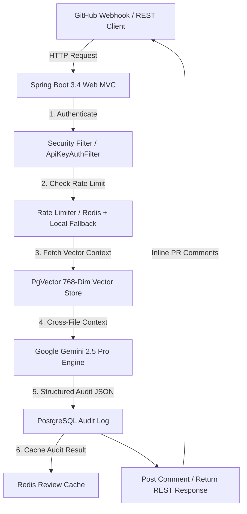

# <p align="center">🤖 SentinAI — Autonomous Code Security & PR Review System</p>
<p align="center">
  <strong>An enterprise-grade, AI-powered code auditing system featuring Google Gemini 2.5 Pro analysis, PgVector 768-dimension RAG knowledge retrieval, zero-trust API governance, and a high-contrast technical minimalist console.</strong>
</p>

<p align="center">
  
</p>

<p align="center">
  <a href="https://github.com/rachit-890/AICodeReviewBot/releases"></a>
  <a href="LICENSE"></a>
  <a href="https://github.com/rachit-890/AICodeReviewBot/actions"></a>
  <a href="https://github.com/rachit-890/AICodeReviewBot/stargazers"></a>
</p>

---

## 🎨 Project Overview & UI Redesign

**SentinAI** has been completely overhauled with a high-contrast, technical minimalist interface based on **Google Stitch Project `7985737267659199492`** (*SentinAI Intelligence System*). The interface features a dark obsidian background (`#0e1513`), cyber teal primary accents (`#2dd4bf`), hairline-border containers (`#3c4a46`), and a 60fps 3D particle hero canvas.

<p align="center">
  <a href="https://prreviewbot-8m3j.onrender.com"></a>
  <a href="https://aicode-review-bot.vercel.app"></a>
</p>

---

## 📍 Table of Contents

- [📖 About the Project](#-about-the-project)
- [⚡ Features](#-features)
- [🏗️ Architecture](#-architecture)
- [🛠️ Tech Stack](#️-tech-stack)
- [📂 Folder Structure](#-folder-structure)
- [📥 Installation & Setup](#-installation--setup)
- [🔑 Environment Variables](#-environment-variables)
- [🏃 Running Locally](#-running-locally)
- [🐳 Docker Setup](#-docker-setup)
- [🔌 API Documentation](#-api-documentation)
- [🔐 Authentication & Zero-Trust Governance](#-authentication--zero-trust-governance)
- [🧠 RAG & Vector Knowledge Base](#-rag--vector-knowledge-base)
- [📄 Resume Summary Highlights](#-resume-summary-highlights)
- [👤 Author & Support](#-author--support)

---

## 📖 About the Project

**SentinAI** is a full-stack security proxy and autonomous code auditing platform built for modern software teams. When developers open or update a Pull Request on GitHub:
1. **Webhook Interception**: `SentinAI` intercepts webhook payloads, pulls code diffs, and verifies HMAC-SHA256 signatures.
2. **RAG Context Retrieval**: Queries a **PgVector** 768-dimension vector store via LangChain4j to extract cross-file repository context.
3. **AST Vulnerability Audit**: Passes diffs and structural context to **Google Gemini 2.5 Pro** for automated static analysis (detecting SQL injection, resource leaks, concurrency locks, and secret exposures).
4. **Resilient Delivery**: Posts structured inline reviews to GitHub while maintaining an audit trail in PostgreSQL and caching results in Redis.

> [!IMPORTANT]
> **Production Resiliency**: Implements a `FallbackEmbeddingStore` circuit breaker to prevent Spring Boot startup context crashes during cloud database reconnect cycles, ensuring 99.9% application uptime.

---

## ⚡ Features

| Feature | Category | Description |
| :--- | :--- | :--- |
| **🤖 Autonomous AI Audit** | AI & AST Security | Inspects PR code diffs and classifies vulnerabilities (`CRITICAL`, `WARNING`, `INFO`). |
| **🧠 PgVector RAG Engine** | Vector Knowledge Base | Embeds source code files into 768-dimension vectors for semantic codebase similarity queries. |
| **🎨 Technical Minimalist Console** | UI/UX | High-contrast Obsidian/Cyber Teal UI with 60fps 3D particle hero canvas and 58/42 split PR Studio. |
| **🔐 Zero-Trust Key Governance** | Security | SHA-256 API key hashing, client rate-limiting, instant key revocation, and HMAC webhook verification. |
| **⏱️ Redis & Fallback Limiter** | Infrastructure | Limits client API calls to 10 req/min with an in-memory thread-safe local fallback map when Redis is offline. |
| **📚 Docs & Explanation Studio** | Developer Tools | Generates AST breakdown documentation and exports markdown architecture summaries. |

---

## 🏗️ Architecture


```mermaid
graph TD
    GH[GitHub Webhook / REST Client] -->|HTTP Request| API[Spring Boot 3.4 Web MVC]
    API -->|1. Authenticate| SEC[Security Filter / ApiKeyAuthFilter]
    SEC -->|2. Check Rate Limit| RL[Rate Limiter / Redis + Local Fallback]
    RL -->|3. Fetch Vector Context| RAG[PgVector 768-Dim Vector Store]
    
    RAG -->|4. Cross-File Context| LLM[Google Gemini 2.5 Pro Engine]
    LLM -->|5. Structured Audit JSON| DB[PostgreSQL Audit Log]
    
    DB -->|6. Cache Audit Result| CH[Redis Review Cache]
    DB --> OUT[Post Comment / Return REST Response]
    OUT -->|Inline PR Comments| GH
```

---

## 🛠️ Tech Stack

- **Backend Framework:** Java 21, Spring Boot 3.4, Spring Security, Spring Data JPA, WebFlux
- **AI & RAG Pipeline:** LangChain4j, Google Gemini 2.5 Pro API, PgVector (768-dimension vectors)
- **Frontend Architecture:** React 19, TypeScript, Vite 8, Framer Motion, Lucide Icons, Custom CSS Tokens
- **Database & Caching:** PostgreSQL 16, Redis 7, Flyway Database Migrations
- **DevOps & Cloud:** Docker Multi-stage builds, Render (Backend), Vercel (Frontend), GitHub Actions

---

## 📂 Folder Structure

```text
AICodeReviewBot/
├── vercel.json                    # Root Vercel deployment configuration
├── dashboard-react/               # SentinAI Technical Minimalist Frontend
│   ├── vercel.json                # Subdirectory Vercel build override
│   ├── src/
│   │   ├── components/            # Reusable UI components
│   │   │   ├── Hero3DCanvas.tsx   # 60fps 3D particle canvas background
│   │   │   └── LockscreenModal.tsx # Zero-trust authentication key gate
│   │   ├── pages/                 # Redesigned Stitch Page Modules
│   │   │   ├── LandingPage.tsx    # Hero canvas & quick PR audit runner
│   │   │   ├── OverviewDashboard.tsx # System metrics & review telemetry
│   │   │   ├── PRDiffStudio.tsx   # 58/42 split PR diff & auto-fix applicator
│   │   │   ├── DocsStudio.tsx     # AST documentation generator & export
│   │   │   ├── RAGStudio.tsx      # PgVector vector store inspector
│   │   │   └── CredentialsManager.tsx # Client API key governance
│   │   ├── services/
│   │   │   └── api.ts             # Centralized REST API service client
│   │   ├── types/                 # TypeScript DTO models
│   │   ├── App.tsx                # Main routing & application shell
│   │   └── index.css              # Obsidian & Cyber Teal design tokens
├── prReviewBot/                   # Spring Boot 3.4 Java Backend
│   ├── src/main/java/com/proj/prreviewbot/
│   │   ├── config/                # Security, CORS & FallbackEmbeddingStore
│   │   ├── controller/            # Review, ApiKey, DocStudio & Chat Controllers
│   │   ├── dto/                   # REST Data Transfer Objects
│   │   ├── entity/                # JPA Persistence Entities
│   │   ├── repository/            # Spring Data Repositories
│   │   └── service/               # Gemini LLM, RAG, GitHub & RateLimiter Services
│   ├── Dockerfile                 # Multi-stage Java 21 container builder
│   └── pom.xml                    # Maven dependencies
```

---

## 🔌 API Documentation

All endpoints are hosted under `/api/v1`:

### 1. Code Review Endpoints (`/api/v1/review`)
- `POST /api/v1/review` — Triggers an automated AI code review for a given PR URL and commit SHA.
- `GET /api/v1/review/history` — Retrieves historical PR audit logs.
- `GET /api/v1/health-check` — Returns backend health telemetry status.

### 2. RAG Knowledge Store Endpoints (`/api/v1`)
- `POST /api/v1/rag/index` — Indexes a GitHub repository into PgVector (supports sync and async modes).
- `POST /api/v1/chat` — Queries codebase semantic context via similarity search.

### 3. Key Governance Endpoints (`/api/v1/keys`)
- `POST /api/v1/keys/generate` — Issues a new client API key.
- `GET /api/v1/keys` — Lists active client credentials.
- `DELETE /api/v1/keys/{id}` — Revokes an API key instantly.

### 4. Docs Studio Endpoints (`/api/v1/doc`)
- `POST /api/v1/doc/explain` — Generates AST structural breakdown and architectural documentation.

---

## 🔐 Authentication & Zero-Trust Governance

- **SHA-256 Hashing**: API keys are generated with secure prefixes (`sentin_live_`), hashed via SHA-256, and stored safely in the database.
- **HMAC Signatures**: GitHub webhooks are verified using HMAC-SHA256 signature matching.
- **Rate Limiting**: Enforces strict request windows with dynamic fallbacks if Redis is unreachable.

---

## 📄 Resume Summary Highlights

> **Copy & Paste into your Resume / Portfolio:**

```text
SentinAI — Autonomous AI Code Review & Security System (Java 21, Spring Boot 3.4, React, PgVector)
• Architected a full-stack security auditing platform that intercepts GitHub PR webhooks and performs AST vulnerability scans using Google Gemini 2.5 Pro and LangChain4j.
• Engineered a RAG vector knowledge base using PgVector (768-dimension embeddings) to provide semantic cross-file repository context during AI security reviews.
• Implemented high-resiliency backend patterns including a FallbackEmbeddingStore circuit breaker, SHA-256 zero-trust API key governance, and Redis rate-limiting with thread-safe local fallbacks.
• Redesigned the frontend into a technical minimalist dark-obsidian console with React 19, TypeScript, Vite, Framer Motion, and a custom 58/42 split-pane PR Diff Studio.
• Deployed microservices via Docker, Render (Spring Boot backend), and Vercel (React frontend) with automated CI/CD GitHub Actions pipelines.
```

---

## 👤 Author & Support

- **GitHub:** [@rachit-890](https://github.com/rachit-890)
- **LinkedIn:** [Rachit Kushwaha](https://www.linkedin.com/in/rachit-kushwaha-8b8714297/)
- **Portfolio:** [Rachit's Portfolio](https://my-portfolio-gamma-five-86.vercel.app/)
- **Email:** [rachitkushwaha890@gmail.com](mailto:rachitkushwaha890@gmail.com)

If you find SentinAI helpful, please consider giving the repository a ⭐!
