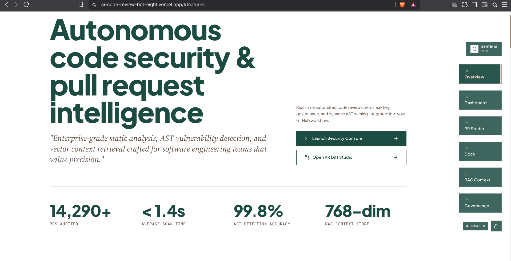

# SentinAI — AI Code Review & RAG Platform

SentinAI is an automated code review platform built with a Java 21 Spring Boot core backend, a Python FastAPI microservice running multi-agent execution graphs, and a React 19 single-page developer dashboard. 

The platform intercepts GitHub pull request events, executes automated security and performance audits, embeds codebase context into PostgreSQL for semantic retrieval (RAG), and displays review scorecards and static analysis metrics.



---

## Project Structure

```
AICodeReviewBot/
├── agent-service/
├── dashboard/
├── dashboard-react/
├── docs/
│   └── images/
├── prReviewBot/
├── .gitignore
├── README.md
├── render.yaml
└── vercel.json
```

### Key Directories

- [`agent-service/`](agent-service/): Python FastAPI microservice that runs the LangGraph security, performance, and aggregator nodes.
- [`dashboard-react/`](dashboard-react/): Single-page React 19 web application used to view code reviews, run repository chat queries, and monitor API keys.
- [`dashboard/`](dashboard/): Standalone legacy static prototype directory. Superseded by [`dashboard-react/`](dashboard-react/).
- [`docs/images/`](docs/images/): Project media assets, screenshots, and architectural diagrams.
- [`prReviewBot/`](prReviewBot/): Main Java Spring Boot 4 service managing REST APIs, PostgreSQL persistence, PgVector embeddings, Redis rate limiting, and GitHub webhooks.

---

## Code Techniques

- **[Custom HTTP Servlet Filtering](https://developer.mozilla.org/en-US/docs/Web/HTTP/Overview#http_flow)**: The [`ApiKeyAuthFilter`](prReviewBot/src/main/java/com/proj/prreviewbot/config/ApiKeyAuthFilter.java) intercepts HTTP requests before Spring Security processing to validate SHA-256 API key hashes and enforce request quotas.
- **[HMAC-SHA256 Signature Verification](https://developer.mozilla.org/en-US/docs/Web/API/SubtleCrypto/sign)**: Webhook requests from GitHub are authenticated via [`WebhookController`](prReviewBot/src/main/java/com/proj/prreviewbot/controller/WebhookController.java) by verifying the `X-Hub-Signature-256` payload header against a shared secret.
- **[Sliding-Window Rate Limiting](https://developer.mozilla.org/en-US/docs/Web/HTTP/Status/429)**: Client request frequencies are tracked using a Redis-backed sliding window algorithm, returning standard HTTP 429 headers when thresholds are exceeded.
- **[Vector Similarity Search](https://developer.mozilla.org/en-US/docs/Web/API/Streams_API)**: Source code chunks are converted into 768-dimensional vector embeddings using Google `text-embedding-004` and queried via cosine similarity in PostgreSQL PgVector.
- **[Asynchronous Task Execution](https://developer.mozilla.org/en-US/docs/Web/API/Fetch_API/Using_Fetch)**: Repository indexing in [`ChatController`](prReviewBot/src/main/java/com/proj/prreviewbot/controller/ChatController.java) returns an HTTP 202 Accepted status while background workers process source files into vector stores.
- **[Directed State Graphs](https://developer.mozilla.org/en-US/docs/Web/JavaScript/Guide/Control_flow_and_error_handling)**: The Python service in [`agent-service/main.py`](agent-service/main.py) constructs an acyclic graph (`SecurityAgent` → `PerformanceAgent` → `Aggregator`) to produce multi-perspective review summaries.

---

## Libraries & Tools

- **[LangChain4j](https://github.com/langchain4j/langchain4j)**: Java library integrating Spring Boot with Google Gemini 2.5 Flash and vector stores.
- **[LangGraph](https://github.com/langchain-ai/langgraph)**: Stateful agent orchestration library used in [`agent-service/`](agent-service/) for complex LLM workflows.
- **[PgVector](https://github.com/pgvector/pgvector)**: PostgreSQL extension enabling vector indexing and similarity search within relational tables.
- **[Flyway](https://flywaydb.org/)**: Schema migration tool managing database version control via `spring-boot-starter-flyway`.
- **[Lettuce](https://github.com/redis/lettuce)**: Non-blocking, thread-safe Java Redis client for key caching and rate-limiting operations.
- **[Framer Motion](https://www.framer.com/motion/)**: Motion library driving UI transitions in [`dashboard-react/`](dashboard-react/).
- **[Lucide React](https://lucide.dev/)**: Component icon library used across the developer dashboard interface.
- **[Oxlint](https://oxc.rs/docs/guide/usage/linter.html)**: High-speed JavaScript and TypeScript linter configured in the frontend build toolchain.
- **[Inter Font](https://fonts.google.com/specimen/Inter)**: Google Font typography applied throughout the web dashboard layout.

---

## Known Infrastructure Limitations

- **Render Free-Tier Database Expiration**: PostgreSQL instances hosted on Render's free tier expire after a fixed operational window (~30 days), requiring manual database provisioning or tier upgrades.
- **Configuration Drift**: The template file [`render.yaml`](render.yaml) specifies static database names (`codereviewdb`), whereas production cloud databases assign dynamic identifiers.
- **CI/CD Configuration**: The workflow file at [`prReviewBot/.github/workflows/deploy.yml`](prReviewBot/.github/workflows/) is located inside a subdirectory and must be moved to the root `.github/workflows/` path to activate GitHub Actions triggers.
