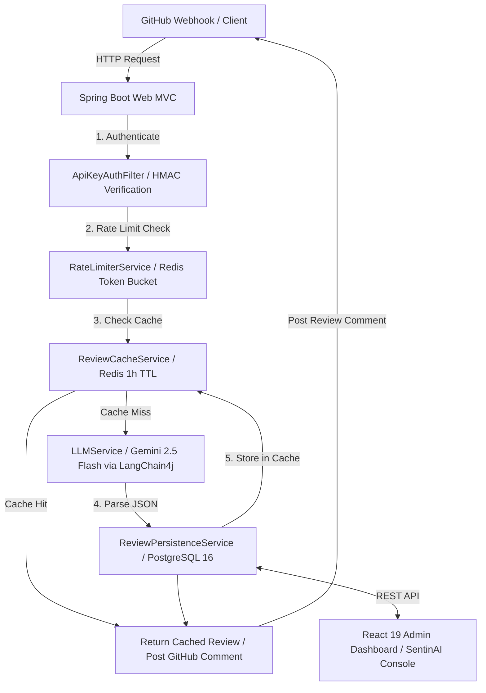

# 📘 Document 1: Existing System Audit & Architecture Guide

## 1. Overview & Core Mission
**AICodeReviewBot** (branded as **SentinAI**) is an automated AI-driven code auditing, security scanning, and pull request analysis platform.

When a developer opens or updates a Pull Request (PR) on GitHub:
1. GitHub fires a webhook event.
2. SentinAI intercepts the event and validates its authenticity using HMAC-SHA256 signatures.
3. The system checks API key validity (SHA-256 hashed) and enforces rate limits (Redis token-bucket).
4. The system checks its Redis cache for prior evaluations of the exact commit SHA.
5. If uncached, it pulls full patch diffs via GitHub REST API and feeds them into **Google Gemini 2.5 Flash** using **LangChain4j**.
6. Gemini generates a structured JSON review with line-by-line findings (`CRITICAL`, `WARNING`, `INFO`), overall score (0-100), and code replacement diffs.
7. Results are saved to PostgreSQL, cached in Redis, and posted as a structured GitHub PR review comment.

---

## 2. End-to-End System Architecture

---

## 3. Tech Stack Inventory

| Tier | Technologies |
| :--- | :--- |
| **Language & Runtime** | Java 21 (LTS) |
| **Backend Framework** | Spring Boot 4.1.0 (Spring Web, Spring Security, Spring Data JPA, WebFlux/WebClient) |
| **AI Integration** | LangChain4j (`langchain4j-google-ai-gemini`), Google Gemini 2.5 Flash Model |
| **Database & ORM** | PostgreSQL 16, Hibernate / JPA, Flyway DB Migrations |
| **Caching & Rate Limiting**| Redis 7 (`spring-boot-starter-data-redis`), ConcurrentHashMap local fallback |
| **Frontend UI** | React 19, TypeScript, Vite, Framer Motion, Lucide Icons, Vanilla Glassmorphism CSS |
| **Build & CI/CD** | Apache Maven 3.9.6, Docker, Docker Compose, GitHub Actions (`deploy.yml`), Render Webhooks |

---

## 4. Deep-Dive Component Audit

### A. Spring Boot Backend (`prReviewBot/`)
* **`config/`**:
  * `SecurityConfig.java`: Configures stateless CORS, disables CSRF, injects `ApiKeyAuthFilter`.
  * `ApiKeyAuthFilter.java`: Intercepts `/api/v1/*` endpoints (except `/keys/generate` and `/webhook/*`), hashes `X-API-Key` with SHA-256, and queries database in $O(1)$ time.
  * `AppConfig.java`: Configures `@EnableAsync` threadpools and `WebClient` beans.
* **`controller/`**:
  * `WebhookController.java`: Endpoints for `POST /api/v1/webhook/github`. Validates `X-Hub-Signature-256` HMAC header.
  * `ReviewController.java`: Endpoints for `POST /review`, `GET /review/{id}`, `GET /review/history`, `DELETE /review/{id}`.
  * `ApiKeyController.java`: Endpoints for `POST /keys/generate`, `GET /keys`, `DELETE /keys/{id}`.
* **`service/`**:
  * `LLMService.java`: Constructs prompt templates for Gemini, cleans JSON code fence markdown blocks, and parses response into `ReviewResponse` DTOs.
  * `GitHubService.java`: Fetches PR files/diffs via GitHub REST API, posts Markdown comments back to PR.
  * `ReviewCacheService.java`: Manages Redis key caching based on MD5(`prUrl` + `headCommitSha`).
  * `RateLimiterService.java`: Token bucket algorithm (10 requests/minute/key). Falls back to `ConcurrentHashMap` with atomic timestamp counters if Redis is offline.
  * `WebhookService.java`: Validates HMAC-SHA256 signatures against incoming raw bytes.
  * `ApiKeyService.java`: Generates raw UUID key, stores SHA-256 hash in DB, updates `lastUsedAt` timestamp.
  * `ReviewPersistenceService.java`: Transactional DB saving of `ReviewEntity` and associated `FindingEntity` records.

### B. Database Schema & Flyway Migrations
* `V1__create_tables.sql`:
  * `reviews`: Stores `id`, `pr_url`, `pr_title`, `repository`, `summary`, `overall_score`, `reviewed_at`, `head_commit_sha`.
  * `findings`: Stores `id`, `review_id` (FK), `severity`, `category`, `file_path`, `line_number`, `title`, `description`, `suggestion`.
* `V2__create_api_keys_table.sql`:
  * `api_keys`: Stores `id`, `key_hash` (Unique SHA-256), `client_name`, `created_at`, `last_used_at`, `is_active`.

### C. Frontend Console (`dashboard-react/`)
* Built with React 19 + TypeScript + Vite.
* `App.tsx`: Full-screen glassmorphism dashboard containing:
  * Metric cards (Total Reviews, Avg Quality Score, Critical Issues, Active API Keys).
  * Review Trigger form (`prUrl` submission).
  * Visual Git-style Unified Diff viewer for code fixes.
  * Key generation & management modal.
  * Live status indicators for Backend, Redis, and Database.

---

## 5. Security & Reliability Highlights
1. **Zero-Trust Token Security:** Raw API keys are never stored in the database. Only SHA-256 hashes are preserved.
2. **HMAC Signature Check:** GitHub webhooks are verified against a shared secret using HMAC-SHA256 to prevent spoofed payloads.
3. **Graceful Degradation:** If Redis fails, the system falls back to an in-memory `ConcurrentHashMap` rate limiter without crashing.
