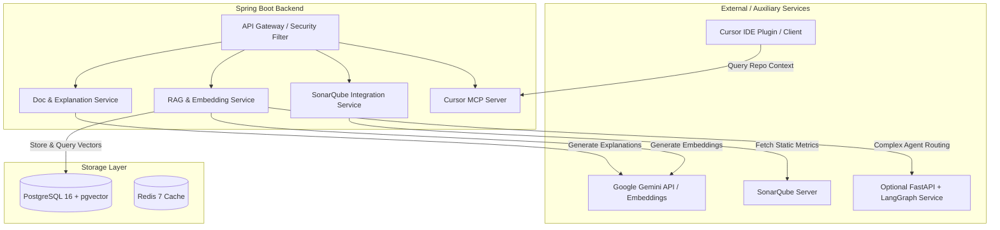

# 📑 Document 2: Gap Analysis & Required Additions

## 1. Feature Comparison Matrix

| Feature / Technology | Target Image Requirement | Current State | Required Change / Addition |
| :--- | :--- | :--- | :--- |
| **Repo Chat (RAG)** | Repository-wide semantic search & AI QA | ❌ Missing | Add file chunking, embedding generation, `pgvector` store, and `/api/v1/chat` endpoint |
| **Vector DB** | Vector Search capability | ❌ Missing | Enable `pgvector` extension in PostgreSQL |
| **Code Docs & Explanation**| Auto-generate docs & code explanations | ❌ Missing | Add `LLMDocService` with `/api/v1/explain` and `/api/v1/docgen` endpoints |
| **SonarQube Integration** | Static code analysis integration | ❌ Missing | Add `SonarQubeService` to query SonarQube REST API and merge static findings with LLM analysis |
| **Multi-Agent / LangGraph** | Agentic workflows for security & docs | ❌ Missing | Add lightweight Python FastAPI + LangGraph microservice or LangChain4j Agent Services |
| **Cursor Integration** | Cursor IDE context & extension support | ❌ Missing | Expose MCP (Model Context Protocol) server endpoint & OpenAPI spec |
| **Kubernetes (K8s)** | Production container orchestration | ❌ Missing | Create `k8s/` directory with Deployment, Service, Ingress, and ConfigMap manifests |

---

## 2. Technical Architecture of New Features

---

## 3. Detailed Specification of Additions

### A. Repository RAG & Vector Search Engine
* **Objective:** Enable developers to query the entire repository using natural language questions (e.g., *"How does rate limiting work in this project?"* or *"Where are API keys stored?"*).
* **Database:** Activate `CREATE EXTENSION IF NOT EXISTS vector;` in PostgreSQL. Create `repo_documents` and `repo_embeddings` tables with vector dimensions matching `text-embedding-004` (768 dimensions).
* **Indexing Workflow:**
  1. Trigger indexing via `POST /api/v1/rag/index`.
  2. Recursive repository reader reads files (ignoring `.git`, target, node_modules).
  3. Splits text into 500-token chunks with 50-token overlap.
  4. Generates embeddings using Gemini Embeddings API.
  5. Inserts chunks + embeddings into `repo_embeddings`.
* **Search Workflow:**
  1. User asks question via `POST /api/v1/chat`.
  2. Question is converted to vector embedding.
  3. Executes Cosine Similarity search in PostgreSQL: `ORDER BY embedding <=> query_vector LIMIT 5`.
  4. Passes retrieved context chunks + question to Gemini for grounded answer generation.

### B. Code Explanation & Documentation Studio
* **Objective:** Explain complex code blocks, detect edge cases, and auto-generate Markdown/Javadoc documentation for any code snippet or repository file.
* **Endpoints:**
  * `POST /api/v1/explain`: Accepts code snippet + language. Returns structured breakdown (Purpose, Key Logic, Potential Pitfalls, Refactoring Suggestions).
  * `POST /api/v1/docgen`: Accepts code snippet + format (`MARKDOWN`, `JAVADOC`). Returns formatted documentation ready for copy/download.

### C. SonarQube Static Analysis Integration
* **Objective:** Combine traditional static code analysis (SonarQube) with AI-powered context to eliminate false positives and auto-generate fixes.
* **Service:** `SonarQubeService.java`
  * Calls SonarQube API `/api/issues/search?componentKeys={repoKey}`.
  * Extracts code smell, security hotspot, and vulnerability metrics.
  * Merges SonarQube findings into Gemini's review prompt for unified reporting.

### D. Python FastAPI + LangGraph Agentic Microservice (Optional Hybrid)
* **Objective:** Run graph-based multi-agent workflows (Security Agent, Lint Agent, Architecture Agent) using LangGraph.
* **Setup:**
  * Directory: `agent-service/`
  * Tech Stack: Python 3.11, FastAPI, LangGraph, LangChain-Google-GenAI, Uvicorn.
  * Spring Boot delegates complex multi-agent reviews to `http://agent-service:8000/api/v1/agent/review`.

### E. Cursor IDE Integration (MCP Server)
* **Objective:** Allow developers using Cursor IDE to query review history, request code explanations, and trigger PR audits directly inside Cursor.
* **Setup:**
  * Implement an MCP-compliant JSON-RPC server or expose OpenAPI specs at `/v3/api-docs` using `springdoc-openapi-starter-webmvc-ui`.

### F. Production Kubernetes Manifests (`k8s/`)
* **Objective:** Production-grade deployment manifests for Kubernetes clusters.
* **Files:**
  * `k8s/postgres-pgvector-deployment.yaml`: Postgres 16 container with `pgvector` enabled.
  * `k8s/redis-deployment.yaml`: Redis 7 deployment.
  * `k8s/backend-deployment.yaml`: Spring Boot backend deployment with readiness & liveness probes.
  * `k8s/frontend-deployment.yaml`: React dashboard Nginx deployment.
  * `k8s/ingress.yaml`: Ingress controller routing `/api` to backend and `/` to frontend.
